# 크리처 디펜스 

## 1. 게임소개

이 게임은 워크래프트의 인기 있던 커스텀 게임 중에 하나인 원피스 랜덤 디펜스의 모작입니다.

몬스터가 가장자리를 돌고 유닛으로 몬스터를 최대한 많이 잡아야 합니다.

원피스 랜덤 디펜스 처럼 유닛을 조합할 수 있고 스테이지가 높아질 수록 몬스터의 체력이 증가해서 몬스터를 잡기 어려워지게 됩니다.

## 2. 게임 조작법

마우스 좌클릭으로 유닛을 이동 시키고 유닛의 사정거리안에 몬스터가 있으면 몬스터를 공격하게 됩니다.

## 3. 게임의 승리 조건

- 스테이지 9를 넘게 되면 게임에서 승리하게 됩니다.

- 몬스터 수가 30을 넘게 되면 게임에서 패배하게 됩니다.

## 4. 게임 플레이

### a. 게임 화면

#### 로딩 화면

  게임을 시작할 때마다 로딩이미지가 랜덤하게 바뀝니다.

#### 타이틀 화면

  - 타이틀 음악이 재생됩니다.
  
  - 게임시작 버튼을 누르면 게임플레이 화면으로 넘어 가게 됩니다.
  
  - 게임방법 버튼을 누르면 메모장이 화면에 나타나고 영어로 게임방법에 대해 적혀있습니다.

#### 플레이 화면
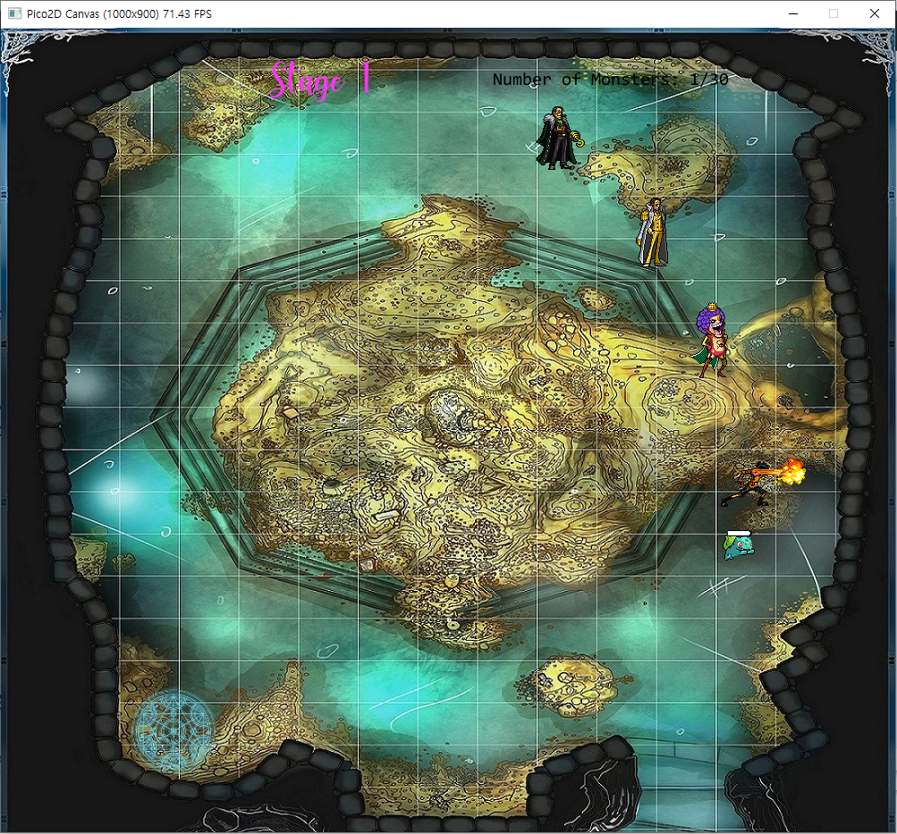

  - 게임을 플레이 할 수 있습니다.

#### 게임오버 화면

  - 게임의 승리 조건 혹은 패배 조건을 충족할 시 게임오버 화면 이 나타나게 됩니다.
  
  - 게임에서 승리할 시에 컨티뉴 버튼이 나오는데 컨티뉴 버튼이 나오면 스테이지가 계속해서 증가 하고 몬스터의 체력도 증가하지만 몬스터의 이미지는 바뀌지 않습니다.

### b. 유닛

 - 캐릭터 마다 파워가 다릅니다.
 
 - 유닛 2명을 마법진으로 이동시켜 임의의 상위유닛으로 조합합니다.
 
#### 종류

 
  - Ace 
  
 
  - Akainu
  
 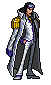
  - Aokiji 
  
 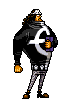
  - Bartholomew Kuma
  
 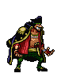
  - Blackbeard 
  
 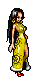
  - Boa Hancock 
  
 
  - Buggy
  
 
  - Chopper
  
 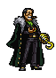
  - Crocodile 
  
 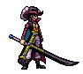
  - Dracule Mihawk
  
 
  - Emporio Ivankov 
  
 
  - Jinbei
  
 
  - Kizaru
  
 
  - MonkeyDLuffy
  
#### 상위 유닛
 
  - Luffy_lv2
  
 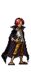
  - Shanks_lv2
  

### c. 몬스터

 - 같은 몬스터는 체력이 일정범위 에서 랜덤입니다.
 
 - 스테이지가 높아질수록 이전 몬스터보다 체력이 높은 범위에서 랜덤입니다.
 
#### 종류

   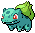
   - stage 1 - Bulbasaur
   
   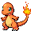
   - stage 2 - Charmander
   
   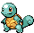
   - stage 3 - Squirtle
   
   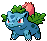
   - stage 4 - Ivysaur
   
   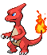
   - stage 5 - Charmeleon
   
   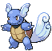
   - stage 6 - Wartortle
   
   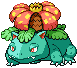
   - stage 7 - Venusaur
   
   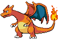
   - stage 8 - Charizard
   
   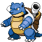
   - stage 9 - Blastoise
   
## 5. 개발 진척도

| 수업주차 | 개발 키워드 | 계획내용 | 개발 내용 |
|---|:---|:---|:---|
| 1주차 | 리소스 | 1. 리소스 수집   2. 해당 좌표에 리소스 적용 | - 많은 리소스 수집   - 좌표 적용하는데 어려움 겪음
| 2주차 | 유닛 오브젝트 | 1. 유닛 이동과 공격 구현   2. 이동, 공격애니메이션 구현   3. 유닛 능력 구현| - 이동, 공격 애니메이션 구현   - 능력은 구현하지 못함
| 3주차 | 건물 오브젝트 | 1. 건물 게이지 구현   2. 건물 스킬버튼 구현 | -건물 오브젝트는 없는 것이 나을 것 같아서 빼버림
| 4주차 | 몬스터 오브젝트 | 1. 12 스테이지까지 각기 다른 몬스터 이동 공격 구현   2. 이동, 공격애니메이션 구현   3. 몬스터 처치시 골드획득 구현 | -9 스테이지까지 각기 다른 몬스터 구현   - 이동애니메이션 구현, 골드는 구현못함
| 5주차 | 조합, 상점 구현 | 1. 조합표, 상점 화면, 버튼 구현   2. 두 유닛을 조합하여 다른 유닛 생성 구현 | - 랜덤하게 상위유닛으로 조합시키도록 구현   - 상점은 구현하지 못함
| 6주차 | 스테이지, 게임플레이 | 1. 12 스테이지인지 체크, 몬스터 수 50 넘어가면 게임오버   2. 각각의 게임 상태와 상태 전환 구현| - 9 스테이지가 넘어가면 승리, 몬스터 수30 넘어가면 게임오버   - 몬스터와 유닛이 상호작용하며 상태가 변함
| 7주차 | 사운드 | 1. 사운드 수집   2. 화면 바뀔 시 다른 음악 적용| - 타이틀 화면음악, 게임오버 시 음악, 메인 게임 음악, 상위 유닛의 목소리 적용
| 8주차 | 점검, 수정 | 1. 최종 점검, 오류 수정   2. 릴리즈하기 | - 릴리즈 완료
| 9주차 | 발표 | 1. 발표준비 |

## 6. 어려웠던 점
- 한 이미지파일 안에 프레임당 이미지가 너무 많이 들어가 있고 위치가 일정한 규칙도 없어서 좌표를 일일이 다 구해야 되나 생각해서 막막했습니다. 결국엔 프레임당 이미지를 전부 다 잘라서 적용시켰습니다. 특히 공격 이미지는 이펙트이미지도 따로 되어 있어서 두 이미지를 하나로 붙여서 저장해야 해서 시간이 엄청 많이 들었습니다. 코딩하는 시간만큼 비슷하게 이미지 작업하는데 시간걸린 것 같습니다. 리소스이미지가 이거보다 더 있는데 시간이 오래 걸려서 다 작업하지 못했습니다.
- 저장 파일을 만들고 여는 것은 어려워서 구현하지 못했습니다.
- 설치파일로 만들고 나서 가끔씩 게임시작버튼을 누르면 튕기는데 파이썬파일로 실행했을 때는 그런 문제가 없어서 코드의 문제는 아닌 것 같습니다.

## 7. 발표 자료 링크
1차 발표: https://www.youtube.com/watch?v=fWWwlIRAdnc

2차 발표: https://www.youtube.com/watch?v=jxLW5VZRMf8

최종발표: https://www.youtube.com/watch?v=4rCBEfDjqk0
