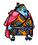

# 크리처 디펜스 

## 1. 게임소개

이 게임은 워크래프트의 인기 있던 커스텀 게임 중에 하나인 원피스 랜덤 디펜스의 모작입니다.

몬스터가 가장자리를 돌고 유닛으로 몬스터를 최대한 많이 잡아야 합니다.

원피스 랜덤 디펜스 처럼 유닛을 조합할 수 있고 스테이지가 높아질 수록 몬스터의 체력이 증가해서 몬스터를 잡기 어려워지게 됩니다.

## 2. 게임 조작법

마우스 좌클릭으로 유닛을 이동 시키고 유닛의 사정거리안에 몬스터가 있으면 몬스터를 공격하게 됩니다.

## 3. 게임의 승리 조건

- 스테이지 9를 넘게 되면 게임에서 승리하게 됩니다.

- 몬스터 수가 30을 넘게 되면 게임에서 패배하게 됩니다.

## 4. 게임 플레이

### a. 게임 화면

#### 로딩 화면

  게임을 시작할 때마다 로딩이미지가 랜덤하게 바뀝니다.

#### 타이틀 화면

  - 타이틀 음악이 재생됩니다.
  
  - 게임시작 버튼을 누르면 게임플레이 화면으로 넘어 가게 됩니다.
  
  - 게임방법 버튼을 누르면 메모장이 화면에 나타나고 영어로 게임방법에 대해 적혀있습니다.

#### 플레이 화면

  - 게임을 플레이 할 수 있습니다.

#### 게임오버 화면

  - 게임의 승리 조건 혹은 패배 조건을 충족할 시 게임오버 화면 이 나타나게 됩니다.
  
  - 게임에서 승리할 시에 컨티뉴 버튼이 나오는데 컨티뉴 버튼이 나오면 스테이지가 계속해서 증가 하고 몬스터의 체력도 증가하지만 몬스터의 이미지는 바뀌지 않습니다.

### b. 유닛
 
  - Ace 
  
 
  - Akainu
  
 
  - Aokiji 
  
 
  - Bartholomew Kuma
  
 
  - Blackbeard 
  
 
  - Boa Hancock 
  
 
  - Buggy
  
 
  - Chopper
  
 
  - Crocodile 
  
 
  - Dracule Mihawk
  
 
  - Emporio Ivankov 
  
 
  - Jinbei
  
 
  - Kizaru
 
  - MonkeyDLuffy
  
#### 상위 유닛
 
  - Luffy_lv2
  
 
  - Shanks_lv2
  

### c. 몬스터
